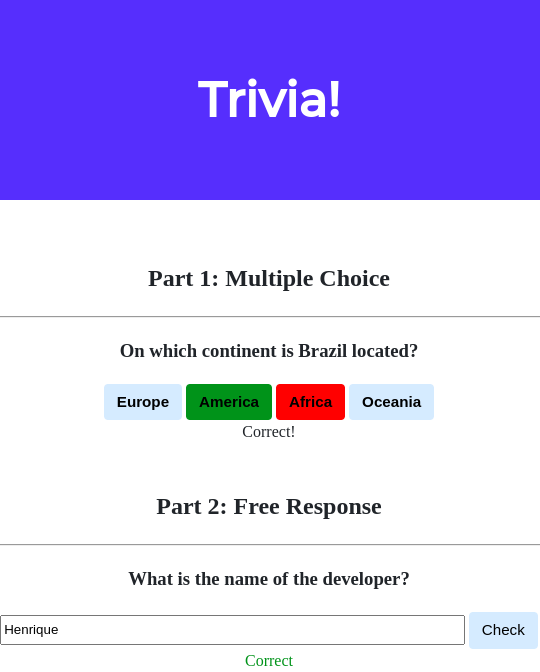
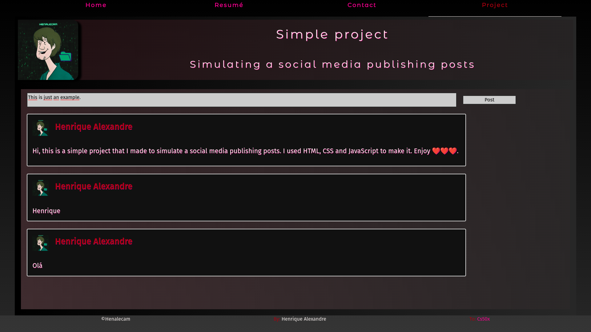

# cs50x-Web-Developing
Internet: Routers; TCP/IP; DNS. HTTP: URLs, GET, POST. HTML: Tags; Attributes. Servers. CSS: Properties; Selectors. Frameworks. JavaScript: Variables; Conditionals; Loops. Events.

## Eighth Week Projects:

## Lab

### [Trivia](https://github.com/Henalecam/cs50x-Web-Developing/tree/main/trivia)

In this lab we build a trivia game using only HTML, JavaScript and CSS.

## Problems

### [Homepage](https://github.com/Henalecam/cs50x-Web-Developing/tree/main/homepage)

In this problem we build a simple 4 pages homepage using HTML, CSS and JavaScript.

